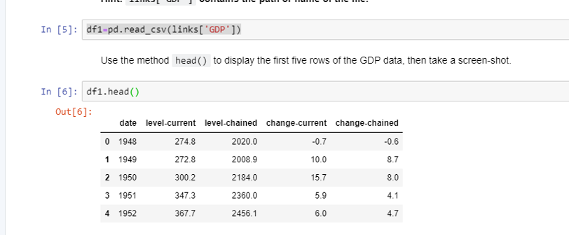
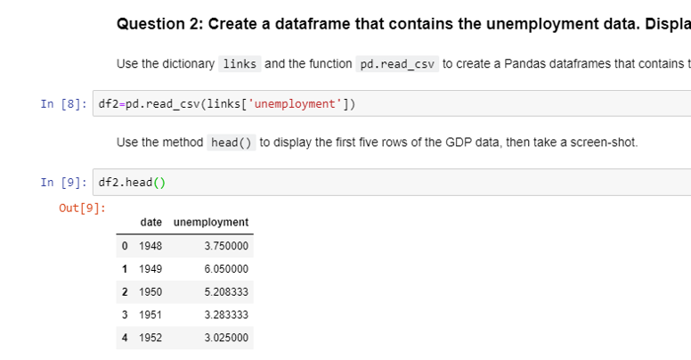
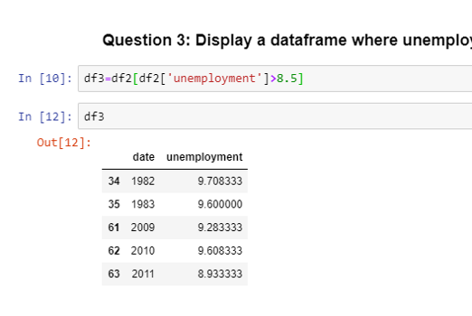
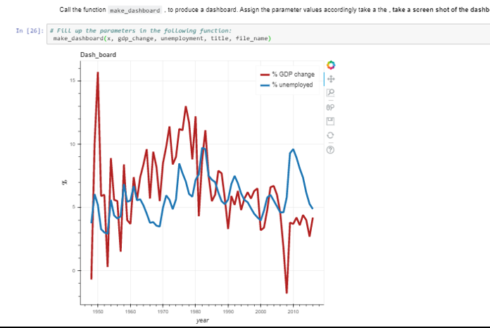

This is the Analysis report of US Economic data using Python on IBM Watson Studio's Notebook.  
# GDP Data
  
# Unemployment Data
  
# Data where unemployment is > 8.5%
   
# Dashboard Using Bokeh which has % GDP change over the Years as well as % Unemployment
  

